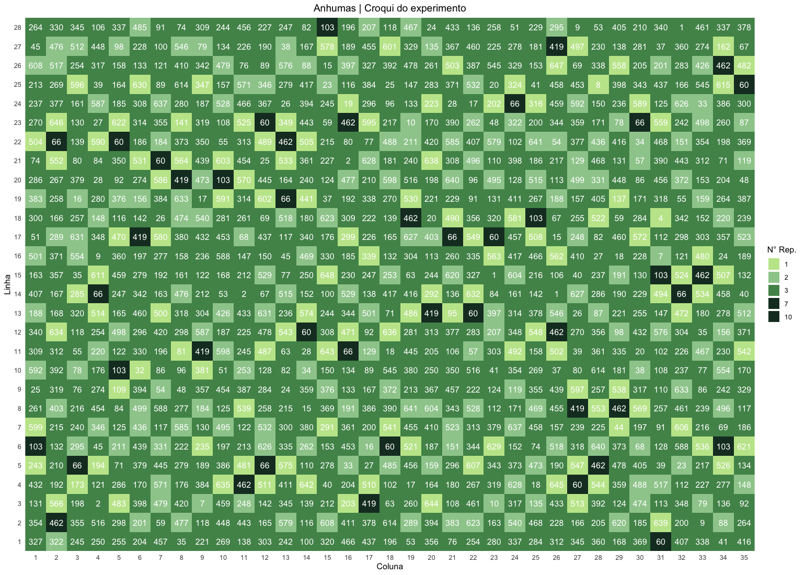

# P-REP DESIGN USING DIGGER PACKAGE 

> **Repository Owner:** *Matheus M. Sousa* </br>
> **Laboratory:** *Laboratório de Melhoramento de Hortaliças - Esalq USP* </br>
> **Guidance:** *Fernando Ângelo Piotto*
>
> O presente repositório visa documentar o uso da biblioteca DiGGer para o sorteio de delineamentos parcialmente repetidos, comumente chamados por p-rep.
>
> É de suma importância que, os pacotes sejam corretamente instalados, cabendo ao usuário fazer a instação do DiGGer via "Archive File" que se encontra em `p-repDesign/digger/DiGGer_1.0.5.tgz`.
>
> Para mais informações, consulte a documentação do pacote, que pode ser encontrada em `p-repDesign/digger/DiGGerQuickGuide.pdf`.

---

### PACOTES NECESSÁRIOS

Todos os pacotes, com excessão do DiGGer, podem ser instalados da maneira que for mais conveniente. Métodos possíveis:
1. Via linha de comando: `install.packages(package)`
2. A partir da interface: `Packages < Install < Search Name < Install all dependencies < Install`

| **NOME**        | **FUNÇÃO**
|:---             |:---
|**DiGGer**       | Biblioteca encarregada por *randomizar* e otimizar os *plots* com base em mini quadrantes para manter uma distribuição equivalente. 
|**R.oo**         | Dependência do DiGGer
|**R.methodsS3**  | Dependência do DiGGer
|**tidyr**        | Conjunto de ferramentas utilizadas para a manipulação de dados
|**dplyr**        | Utilizada para filtrar, agrupar e resumir conjunto de dados
|**ggplot2**      | Usada para visualização de dados 
|**readr**        | Lê arquivos planos (ex.: .csv)
|**readxl**       | Lê arquivos em formato Excel
|**viridis**      | Paleta de cores utilizada nas plotagens (*substituível/opicional*)
|**here**         | Auxilia no gerenciamento de caminhos de arquivos e diretórios (*permite acessar e gravar dados advindos de multiplos locais do diretório de trabalho*)

---


Os delineamentos *partially replicated* ou simplesmente p-rep são comparados aos delineamentos aumentados, nos quais todos os tratamentos não são replicados, exceto por alguns tratamentos padrão, conforme tratado por [Federer et al. (1975)](https://www.jstor.org/stable/2529426).

De forma geral, no p-rep há uma distribuição não equivalente dos tratamentos, com alguns repetindo uma ou mais vezes, enquanto que outros não são replicados. Os tratamentos de interesse são repetidos em quantidades possíveis enquanto que parcelas padrão são dispostas para a avaliação dos erros e efeitos ambientais permitindo a inferência estatística, conforme este [*quick stat guide*](https://vsni.co.uk/blogs/p-rep_designs_CycDesigN).

## p-REP COM DIGGER

### Aleatorização dos tratamentos

Utiliza a função `prDiGGer`:

> PS: Os dados devem estar aossicados à um id numérico, de forma que o n° de repetição esteja ordenado para facilitar a associação do tratamento ao nº de replicações no delineamento.

```r
prepDesign <- prDiGGer(numberOfTreatments=a,
                rowsInDesign=b, 
                columnsInDesign=c, 
                treatRepPerRep=rep(c(y1,yn),c(z1,zn)), 
                treatGroup=rep(c(k1,kn),c(l1,ln)),
                blockSequence=list(c(i1,j1),c(i2,j2),c(i3,j3)),
                ##rngSeeds = c(x0, x0),
                runSearch=T)
```

| Atributos            | Variáveis exemplo | Tarefa                              |
|:-----------          |:------------:     |:-------------------                 |
| `numberOfTreatments` | a                 | Número total de tratamentos únicos; |
| `rowsInDesign`       | b                 | Número de linhas no design;         |
| `columnsInDesign`    | c                 | Número de colunas no design;        |
| `treatRepPerRep`     | y<sub>1</sub>     | Número de repetições dos tratamentos no intervalo z<sub>1</sub>; |
|                      | y<sub>n</sub>     | Número de repetições dos tratamentos no *enésimo* intervalo; |
|                      | z<sub>1</sub>     | Tamanho absoluto do intervalo de tratamentos com n° de repetições = y<sub>1</sub>; |
|                      | z<sub>n</sub>     | Tamanho absoluto do *enésimo* intervalo de tratamentos com n° de repetições = y<sub>n</sub>; |
| `treatGroup`         | k<sub>1</sub>     | Agrupamento do primeiro conjunto de tratamentos; |
|                      | k<sub>n</sub>     | Agrupamento do *enésimo* conjunto de tratamentos; |
|                      | l<sub>1</sub>     | Tamanho absoluto do primeiro grupo de tratamentos; |
|                      | l<sub>n</sub>     | Tamanho absoluto do *enésimo* grupo de tratamentos; |
| `blockSequence`      | i<sub>1</sub>     | Nº de linhas do primeiro mini quadrante utilizado para otimização; |
|                      | i<sub>n</sub>     | Nº de linhas do *enésimo* mini quadrante utilizado para otimização; |
|                      | j<sub>1</sub>     | Nº de colunas do primeiro mini quadrante utilizado para otimização; |
|                      | j<sub>n</sub>     | Nº de colunas do *enésimo* mini quadrante utilizado para otimização; |

> Recomenda-se fazer 3 otimizações utilizando o atributo `blockSequence`.
>
> - 1° quadrante: otimização em <sup>1</sup>/<sub>2</sub> da área → i<sub>1</sub>=b  e j<sub>1</sub>=<sup>c</sup>/<sub>2</sub>
>
> - 2° quadrante: otimização em <sup>1</sup>/<sub>4</sub> da área → i<sub>2</sub>=<sup>b</sup>/<sub>2</sub> e j<sub>2</sub>=<sup>c</sup>/<sub>2</sub>
>
> - 3° quadrante: otimização em <sup>1</sup>/<sub>2</sub> de cada coluna → i<sub>3</sub>=<sup>b</sup>/<sub>2</sub> e j<sub>3</sub>=1
> 
> Caso dê erro após iniciar a otimização, reorganize o tamanho dos quadrantes. 

### Plotagem dos dados com base no ID

Utiliza as funções `getDesign` e `desPlot`:

```r
prepDesign <- getDesign(prepDesign)

desPlot(prepDesign,seq("z1"),col="green1",new=TRUE,label=TRUE)
desPlot(prepDesign,seq("z2")+"z1",col="green2",new=FALSE,label=TRUE)
desPlot(prepDesign,seq("z3")+"z1+z2",col="green3",new=FALSE,label=TRUE,
        bdef=cbind(14,38),bcol="#1f2124",bwd=4)
```

| Função               | Atributos          | Tarefa |
|:-----------          |:----               |:----   |
| `getDesign`          |                    | Associa o design gerado á um data frame
| `desPlot`            |                    | Plota os tratamentos em forma de uma matriz
|                      | `seq`              | Sequência dos números equivalente ao intervalo de tratamentos com n° de repetições = y<sub>n</sub>
|                      | `col`              | Cor do plot
|                      | `new`              | Para `True` plota uma nova matriz que sobrepõe as demais. Só deve ser true para a primeira plotagem
|                      | `label`            | Para `True` o plot terá o número plotado na parcela

## ETL DOS DADOS E DESIGN FINAL

É convenção ordenar as fontes de dados dentro de diretórios, classificando-os quanto a sua natureza, formato, tipo ou qualquer outro argumento agrupador. Para facilitar a leitura e escrita de arquivos em multiplos diretórios, utiliza-se de ferramentas fornecidas pela biblioteca `here`, que nos permite associar o diretório á uma variável e acioná-la em funções que necessitam do diretório. Caso tenha dúvidas sobre o seu uso, consute a [documentação](https://cran.r-project.org/web/packages/here/vignettes/here.html). 

### Extração dos dados produzidos pelo DiGGer e leitura das planilhas
1. Para extrair o delineamento otimizado pelo DiGGer, utilize a função `write_csv`;

```r
pathRaw <- file.path(dirRaw, "matrix.csv") 
write_csv(prepDesign, pathRaw)
```
2. Abra o arquivo no seu editor de tabelas, exclua a numeração *ij* da matriz (1ª linha/coluna);
3. Salve o arquivo em .xlsx na pasta rawData;
4. Abra os arquivo *matrix* e *raw* utilizando a função `read_excel` da biblioteca readxl;

Primeiramente, os dados gerais do experimento são lidos do arquivo raw.xlsx, e em seguida, a matriz gerada pelo DiGGer é lida do arquivo matrix.xlsx. Esta matriz contém os IDs falsos que serão posteriormente substituídos pelos IDs verdadeiros.

```r
pathRaw <- file.path(dirRaw, "raw.xlsx")
dbGeneral <- read_excel(pathRaw)

pathRaw <- file.path(dirRaw, "matrix.xlsx")
mx <- read_excel(pathRaw, col_names = F) #
```

### Substituição dos falso IDs pelos verdadeiros
Os nomes das colunas da matriz são renomeados para números sequenciais. Em seguida, a matriz é transformada do formato largo para o formato longo, onde as linhas e colunas são reorganizadas, e os IDs falsos (diggerID) são substituídos pelos IDs verdadeiros do painel (idAcesso) utilizando a função `join` com os dados gerais.

````r
colnames(mx) <- 1:ncol(mx)

longMx <- mx %>%
  mutate(Linha = row_number()) %>% 
  pivot_longer(cols = -Linha, 
               names_to = "Coluna", 
               values_to = "diggerID")

newMx <- longMx %>%
  left_join(dbGeneral, by = "diggerID") %>%
  select(-diggerID) %>%
  rename(Value = `idAcesso`)

newMx <- newMx %>%
  mutate(Coluna = as.integer(Coluna))

newMx <- newMx %>% rename("idAcesso" = "Value")
````

### Gerando o mapa da área

Visto que o *p-rep design* é constituído de tratamentos com números diferentes de repetições, o seguinte exemplo de coloração do delineamento terá como escala o número de repetições do material. Para isso, cria-se uma variável que irá armazenar o código de cores hexadeciamal (*#HEX*) em função dos números de repetições presentes no experimento. No caso exemplo, há tratamentos com uma, duas, três, sete e dez repetições. 

````r
corRep <- c("1" = "#C2E699", "2" = "#78C679", "3" = "#519259", "7" = "#18392B", "10" = "#18392B")

ggplot(newMx, aes(x = Coluna, y = Linha, fill = factor(nRep), label = idAcesso)) +
  geom_tile(
    lwd = 1, width = 1, height = 1) + 
  geom_text(color = "white") +
  scale_fill_manual(values = corRep) +  
  scale_x_continuous(breaks = unique(newMx$Coluna), labels = unique(newMx$Coluna),
                     expand = c(0, 0)) + 
  scale_y_continuous(breaks = unique(newMx$Linha), labels = unique(newMx$Linha),
                     expand = c(0, 0)) + 
  labs(title = "Anhumas | Croqui do experimento",
       x = "Coluna",
       y = "Linha",
       fill = "N° Rep.") +
  theme_minimal() +
  theme(panel.grid = element_blank(),
        plot.title = element_text(hjust = 0.5))
````

Executando o código, deve-se obter algo semelhante a imagem a seguir: 



---
### Author

> Matheus Martins de Sousa
* [GitHub](https://github.com/Matheus21sousa)
* [LinkedIn](www.linkedin.com/in/matheusmartinssousa)
* E-mail: matheus21martins@outlook.com